# Навык `1c-full-cycle-dev`

Полный цикл разработки доработки в **существующей** конфигурации 1С:Предприятие: оценка и артефакты по фазам, исследование кодовой базы, PRD и ADR, ревью плана до реализации, таск-лист и единый контекст для разработчика, реализация по подзадачам, ревью кода, итоги и опциональное обновление документации. Рабочие файлы задачи — в `.tasks/task-[feature-name]/`.

Нормативное описание процесса и Phase Gate — в [`SKILL.md`](./SKILL.md).

## Происхождение и зависимости

- **Воркфлоу** — **глубоко модернизирован** относительно идей и структуры [AndreevED/1c-ai-feature-dev-workflow](https://github.com/AndreevED/1c-ai-feature-dev-workflow) (в том репозитории — исходный AI-воркфлоу для доработок 1С; корни подхода — feature-dev Anthropic). Текущий навык расширяет процесс до **фаз 0–12**, вводит формальный **PRD**, **ADR**, приёмку, индекс контекста для реализации и отдельный режим доработок по приёмке.
- **Агент `1c-code-explorer`** (Phase 2) — **изменённый** вариант агента исследования кодовой базы из линии [AndreevED/1c-ai-feature-dev-workflow](https://github.com/AndreevED/1c-ai-feature-dev-workflow); в проекте размещается как файл в `.cursor/agents/` (например `1c-code-explorer.md` или эквивалент с тем же `name` в frontmatter).
- **Остальные роли** (`1c-developer`, `1c-architect`, `1c-arch-reviewer`, `1c-code-reviewer`, `1c-doc-writer`, `1c-analytic` и связанная инфраструктура правил, MCP, навыков) ориентированы на набор [comol/cursor_rules_1c](https://github.com/comol/cursor_rules_1c): правила в `.cursor/rules/`, агенты в `.cursor/agents/` (имена с префиксом `1c-` задаются в YAML frontmatter файлов).

Навык **не содержит** полных промптов агентов — только маршрутизацию фаз и артефактов.

## Для чего

- Согласовать понимание задачи и зафиксировать требования до проектирования.
- Исследовать существующие паттерны и точки интеграции в кодовой базе.
- Получить утверждённые **PRD**, архитектурный план и **ADR** с учётом специфики 1С.
- Провести **ревью плана до реализации** и утвердить таск-лист.
- Реализовать подзадачи с единой точкой передачи контекста (`phase9-context-index.md`).
- Провести ревью кода с опорой на план, PRD и ADR; зафиксировать итоги и при необходимости обновить документацию проекта.
- Работать по **замечаниям приёмки** без повторного прохождения фаз 0–8 при наличии сохранённых артефактов задачи (см. [`SKILL.md`](./SKILL.md)).

## Как вызывать

Триггеры и краткое назначение заданы в поле `description` в frontmatter [`SKILL.md`](./SKILL.md). В Cursor навык подключается, когда пользователь явно просит полный цикл доработки, новый функционал, приёмку/UAT или доработку по списку дефектов после приёмки — формулировка должна соответствовать описанию навыка.

Рекомендуется вызывать напрямую:
```bash
/1c-full-cycle-dev Добавить интеграцию с API складской системы
```

## Основной воркфлоу (фазы 0–12)

Все фазы **0–12** для **новой** доработки выполняются последовательно; оценка сложности влияет на глубину анализа, число параллельных исследователей/архитекторов и обязательность отдельных gate для ADR, но **не отменяет** фазы. Подробности и таблица обязательных подтверждений пользователя — в [`SKILL.md`](./SKILL.md).

| Фаза | Кратко | Ключевой артефакт |
|------|--------|-------------------|
| 0 | Инициализация, оценка сложности | `phase0-complexity.md` |
| 1 | Discovery, подтверждение понимания | `phase1-requirements.md` |
| 2 | Исследование кодовой базы (адаптивно) | `phase2-exploration.md` |
| 3 | Уточняющие вопросы до проектирования | `phase3-clarifications.md` |
| 4 | PRD через **`1c-analytic`**, gate | `prd.md` (структура по [`SKILL.md`](./SKILL.md); оркестратор брифует, аналитик пишет файл) |
| 5 | Архитектурный план, gate | `phase5-architecture.md` |
| 6 | ADR, обновление PRD (связанные артефакты), gate по сложности | `adr.md` |
| 7 | Ревью плана (с учётом ADR), gate | `phase7-plan-review.md` |
| 8 | Таск-лист, запись приёмки, индекс контекста Phase 9, gate | `tasks.md`, `acceptance-record.md`, `phase9-context-index.md` |
| 9 | Реализация по подзадачам: `1c-developer` и при метаданных — `1c-metadata-manager`; опц. `1c-error-fixer` (BSL) | исходники 1С в репо + `tasks.md`, `phase9-context-index.md` |
| 10 | Ревью кода | `phase10-code-review.md` |
| 11 | Итоги, вопрос об обновлении документации, gate | `phase11-summary.md` |
| 12 | Обновление документации (только при явном согласии) | по результатам `1c-doc-writer` |

## Связывание артефактов по фазам

Узлы на диаграммах — **файлы** в `.tasks/task-[feature-name]/`, **исходники конфигурации** в репозитории (узел «источники 1С») или **документация проекта** (Phase 12). Стрелки означают опору на входные артефакты и появление или обновление результата на выходе фазы. **Phase Gate** — подтверждение в чате, не отдельный файл; порядок gate — в [`SKILL.md`](./SKILL.md).

### Общая диаграмма

```mermaid
flowchart LR
  wf["workflow-state.md"]
  c0["phase0-complexity.md"]
  r1["phase1-requirements.md"]
  e2["phase2-exploration.md"]
  c3["phase3-clarifications.md"]
  prd["prd.md"]
  ar5["phase5-architecture.md"]
  adr["adr.md"]
  r7["phase7-plan-review.md"]
  pack["tasks.md acceptance-record phase9-context-index"]
  src["Repo 1C sources"]
  r10["phase10-code-review.md"]
  s11["phase11-summary.md"]
  d12["Project docs if Phase12"]
  wf --> c0 --> r1 --> e2 --> c3 --> prd --> ar5 --> adr --> r7 --> pack --> src --> r10 --> s11 --> d12
```

Между `phase3-clarifications.md` и стабильным `prd.md` лежит **Phase 4** (при необходимости — опциональный цикл с `phase4-prd-review.md`). Узел `pack` объединяет три артефакта Phase 8. `Repo 1C sources` — фактические правки `.bsl`, `.xml` и др. после Phase 9. Phase 12 выполняется только при явном согласии после Phase 11.

### Phase 0: Инициализация и оценка сложности

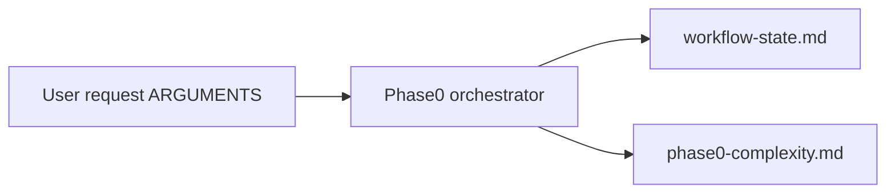

### Phase 1: Discovery

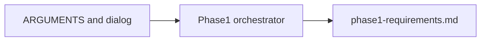

### Phase 2: Исследование кодовой базы

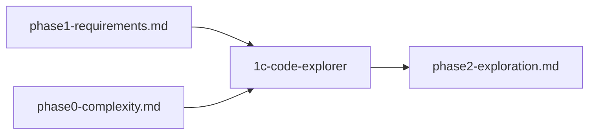

### Phase 3: Уточняющие вопросы

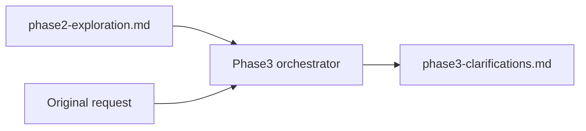

### Phase 4: Создание PRD

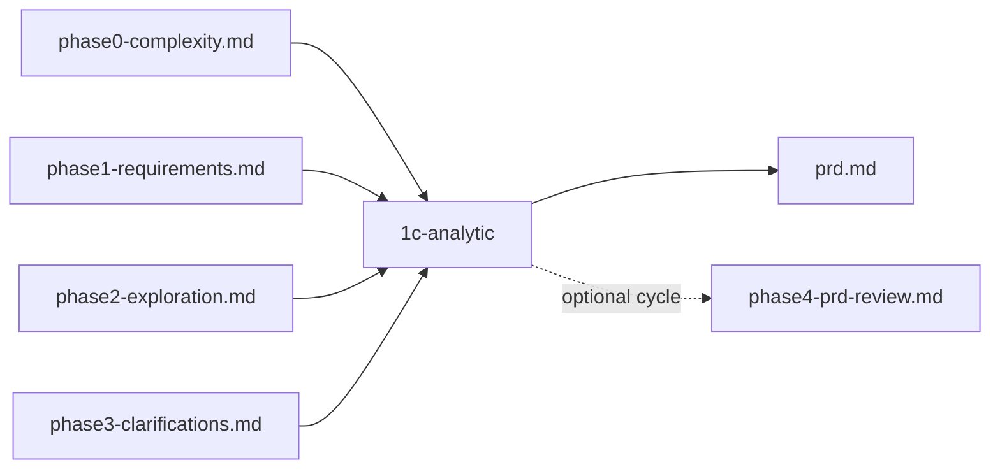

Опциональный цикл ревью PRD (до двух итераций): замечания в `phase4-prd-review.md` и точечные правки `prd.md` — см. [`SKILL.md`](./SKILL.md).

### Phase 5: Проектирование архитектуры

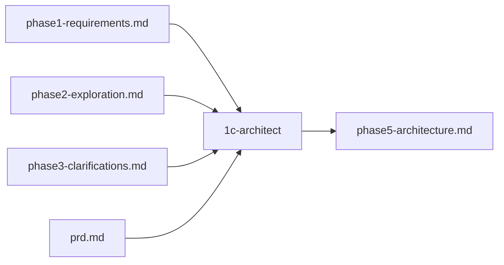

### Phase 6: ADR

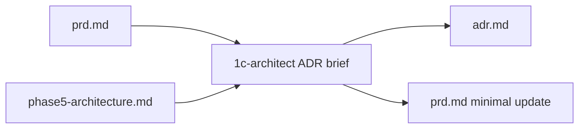

Gate утверждения `adr.md` зависит от оценки в `phase0-complexity.md` (для «Простая» отдельного gate Phase 6 нет — см. [`SKILL.md`](./SKILL.md)).

### Phase 7: Ревью плана

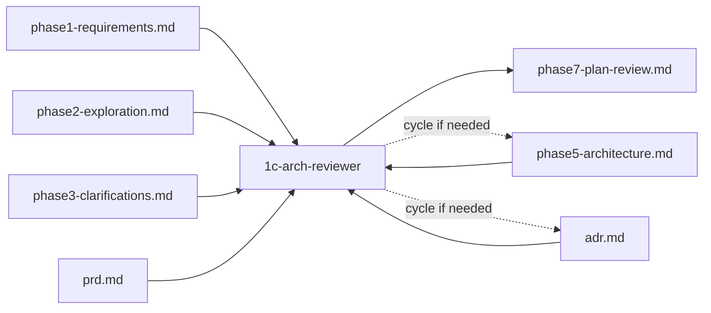

При цикле правок могут меняться `phase5-architecture.md` и `adr.md`. Если `adr.md` менялся в цикле Phase 7 — отдельный gate утверждения ADR (в т.ч. для «Простая») перед финальным gate ревью плана — см. [`SKILL.md`](./SKILL.md).

### Phase 8: Таск-лист и приёмка

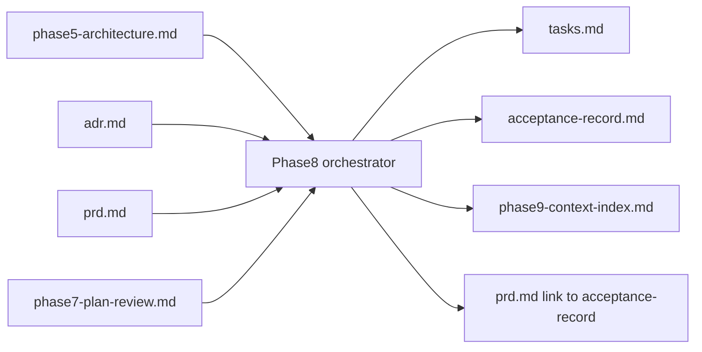

### Phase 9: Реализация по подзадачам

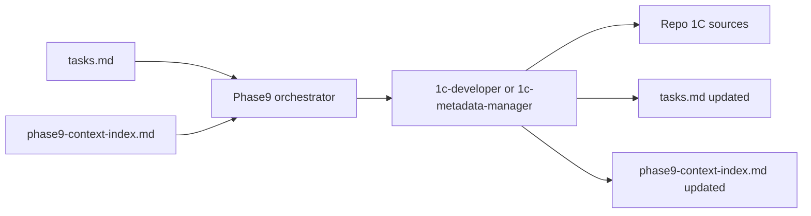

Оркестратор при необходимости вызывает **`1c-error-fixer`** (только для BSL и исполнителя `1c-developer`). Исполнитель читает канонические пути из индекса — см. [`SKILL.md`](./SKILL.md).

### Phase 10: Ревью кода

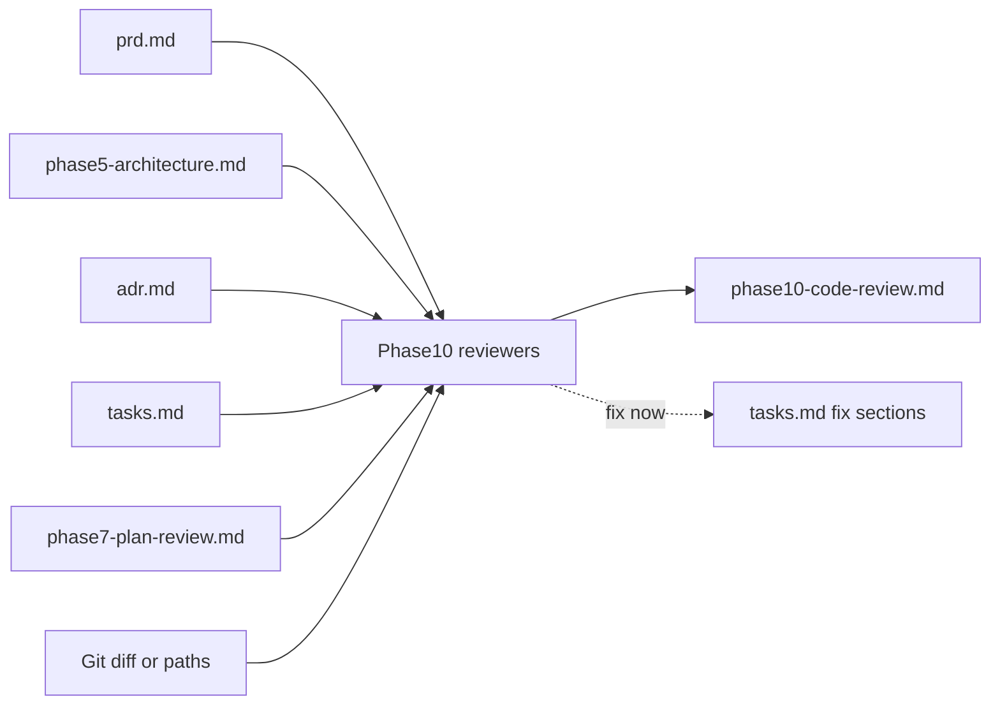

Ветка ревьюеров: при **простой** задаче и не сработавшем пороге объёма — в основном `1c-code-reviewer`; при **средней/сложной** или крупном охвате — пара `1c-arch-reviewer` + `1c-code-reviewer` (детали и опции `1c-performance-optimizer` / `1c-tester` — в [`SKILL.md`](./SKILL.md)).

### Phase 11: Итоги

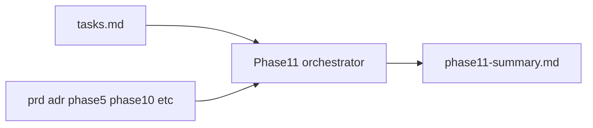

### Phase 12: Документация проекта

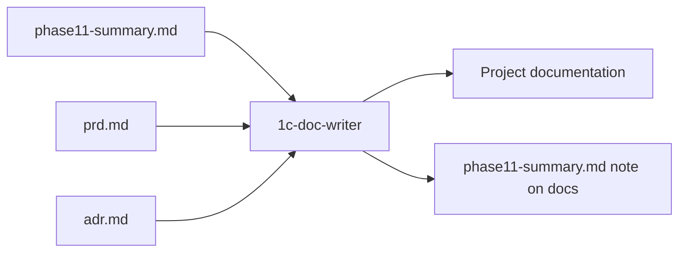

Запуск только при **явном согласии** пользователя в сообщении после вопроса Phase 11.

### Режим приёмочные исправления

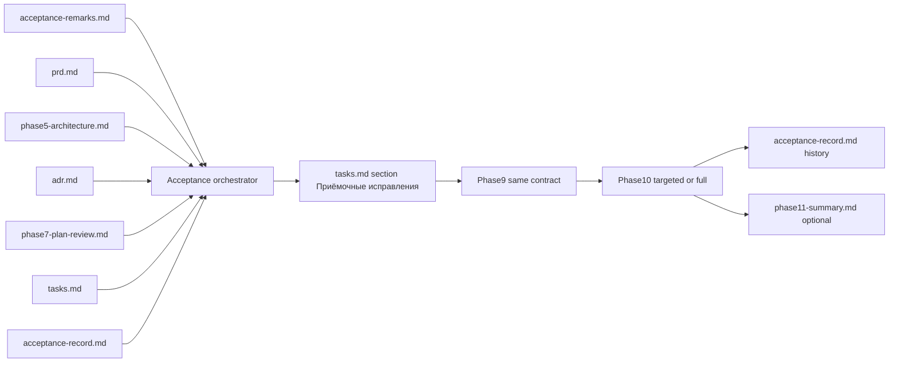

Фазы 0–8 не повторяются; детали шагов — раздел «Замечания приёмки и доработки» в [`SKILL.md`](./SKILL.md).

## Прерывание и новый чат

Работа идёт не «в голове» у модели, а в **папке задачи** в репозитории: там лежат PRD, план, ADR, таск-лист и остальные артефакты. Скилл дополнительно ведёт служебный файл **`workflow-state.md`** — в нём зафиксировано, на каком этапе конвейера вы сейчас и нужно ли дождаться вашего решения перед следующим шагом. Закрыли окно, разрядился ноутбук, начали диалог заново — не страшно: откройте навык снова, **укажите путь к той же папке** (например, `.tasks/task-имя-задачи/`), и можно продолжить работу с сохранённой отметки. Подробные правила, в том числе когда обязательны ваши ответы на контрольных точках, описаны в [`SKILL.md`](./SKILL.md).

### На каких фазах можно прервать и возобновить

По [`SKILL.md`](./SKILL.md) **прерывание сессии допускается в любой момент** полного цикла: на **любой** из фаз **0–12**, в том числе после сохранения артефакта фазы и **до** ответа на Phase Gate в чате. То же относится к **режиму приёмочных исправлений** (работа по `acceptance-remarks.md` без повторения фаз 0–8): сессию можно оборвать между шагами.

**Возобновление в новом чате** всегда опирается на **каталог задачи** (типично `.tasks/task-[feature-name]/`), а не на историю диалога. Рекомендуется читать **`workflow-state.md`**: по одним только файлам артефактов нельзя надёжно отличить «документ уже записан» от «gate в чате уже закрыт» — без актуального `workflow-state.md` оркестратор должен **одним вопросом** уточнить открытый gate (см. [`SKILL.md`](./SKILL.md)).

| Фазы | Прерывание | Что важно для возобновления |
|------|------------|-----------------------------|
| **0–1** | Да | `workflow-state.md`, `phase0-complexity.md`, `phase1-requirements.md`; на границе Phase 1 — явное подтверждение понимания перед Phase 2 |
| **2–3** | Да | Сохранённые `phase2-exploration.md`, `phase3-clarifications.md`; при обрыве **внутри** исследования или ожидания ответов по Phase 3 продолжение — по содержимому этих файлов и примечанию в `workflow-state.md` |
| **4–8** | Да | Артефакты фаз + **`workflow-state.md`** (`ожидается_gate` для Phase 4, 5, 6*, 7*, 8); при висевшем gate в новом чате нужна **явная фраза**, закрывающая соответствующий gate (*Phase 6: отдельный gate ADR зависит от сложности и цикла Phase 7 — см. [`SKILL.md`](./SKILL.md)) |
| **9** | Да | Помимо фазы в `workflow-state.md` — **`tasks.md`** (чекбоксы `[ ]` / `[O]` / `[x]`) и **`phase9-context-index.md`** (текущая подзадача, выдержки, блок «Исправление»), иначе не восстановить точку внутри реализации |
| **10** | Да | **`phase10-code-review.md`**, **`tasks.md`** (секции исправлений / техдолга), при цикле «исправить сейчас» — снова **`phase9-context-index.md`** |
| **11–12** | Да | **`phase11-summary.md`**; Phase 12 только при **явном согласии в следующем сообщении** после вопроса Phase 11 — в новом чате это снова явное подтверждение пользователя |
| **Приёмочные исправления** | Да | `acceptance-remarks.md`, секция **`## Приёмочные исправления`** в `tasks.md`, далее тот же механизм, что Phase 9–10 |

Если **`workflow-state.md`** отсутствует или рассинхронизирован с файлами на диске, после уточнения у пользователя его следует **создать или обновить** для следующих сессий (как в [`SKILL.md`](./SKILL.md)).

## Режим «приёмочные исправления»

Если в `.tasks/task-[feature-name]/` уже есть артефакты исходной задачи и пользователь явно запускает работу по файлу замечаний приёмки, **не** повторяются фазы 0–8; выполняются шаги из раздела «Замечания приёмки и доработки» в [`SKILL.md`](./SKILL.md) (в т.ч. Phase 9–10 и обновление `acceptance-record.md`).

## Агенты

| Агент | Фаза | Назначение | Происхождение роли |
|-------|------|------------|-------------------|
| `1c-code-explorer` | 2 | Глубокий анализ и трассировка кодовой базы | Линия [AndreevED/1c-ai-feature-dev-workflow](https://github.com/AndreevED/1c-ai-feature-dev-workflow), **модифицированный** промпт в проекте |
| `1c-analytic` | 4 | PRD (`prd.md`) по Phase 0–3: требования, 1С-терминология, ID критериев приёмки; без кода | Промпт в проекте (например `analytic.md`); см. [`SKILL.md`](./SKILL.md), Phase 4 |
| `1c-architect` | 5, 6, 10 (при необходимости) | Архитектура, ADR, сверка кода с планом | [comol/cursor_rules_1c](https://github.com/comol/cursor_rules_1c) |
| `1c-arch-reviewer` | 7; 10 (пост-реализация) | Ревью плана до реализации и аудит соответствия после Phase 9 | [comol/cursor_rules_1c](https://github.com/comol/cursor_rules_1c) |
| `1c-developer` | 9; исправления в 10; приёмочные доработки | Реализация BSL и правки кода (вход: `phase9-context-index.md`) | [comol/cursor_rules_1c](https://github.com/comol/cursor_rules_1c) |
| `1c-metadata-manager` | 9; исправления в 10; приёмочные доработки | Мутации метаданных в XML (вход: `phase9-context-index.md`; см. [`SKILL.md`](./SKILL.md)) | [comol/cursor_rules_1c](https://github.com/comol/cursor_rules_1c) |
| `1c-error-fixer` | 9 (опц.) | Синтаксис BSL при исполнителе `1c-developer` | [comol/cursor_rules_1c](https://github.com/comol/cursor_rules_1c) |
| `1c-code-reviewer` | 10 | Ревью кода | [comol/cursor_rules_1c](https://github.com/comol/cursor_rules_1c) |
| `1c-performance-optimizer` | 10 (опц.) | Узкий проход по производительности при NFR или HIGH+ | см. [`SKILL.md`](./SKILL.md) |
| `1c-tester` | 10 (опц.) | Смоук/UI по запросу или готовому сценарию | см. [`SKILL.md`](./SKILL.md) |
| `1c-doc-writer` | 12 | Обновление документации проекта | [comol/cursor_rules_1c](https://github.com/comol/cursor_rules_1c) |

В каталоге `.cursor/agents/` файлы могут называться, например, `developer.md`, `architect.md`, `analytic.md`; обращение в Cursor идёт по полю `name` в frontmatter (например `name: 1c-developer`, `name: 1c-analytic`).

## Использование агентов отдельно

Полный цикл необязателен — отдельные роли можно вызывать по смыслу задачи, например:

- «Запусти `1c-code-explorer` для разбора цепочки вызовов при проведении документа X».
- «Запусти `1c-analytic` для черновика PRD по папке `.tasks/task-…` и артефактам Phase 1–3» (в полном цикле это делает оркестратор в Phase 4).
- «Запусти `1c-architect` для вариантов реализации интеграции с внешним API».
- «Запусти `1c-developer` для реализации процедуры Y по краткому ТЗ».
- «Запусти `1c-code-reviewer` для проверки последних изменений в модуле Z».

## Установка

1. Развернуть в проекте содержимое [comol/cursor_rules_1c](https://github.com/comol/cursor_rules_1c) в `.cursor/` (правила, агенты — в т.ч. **`1c-analytic`** для Phase 4 / PRD, рекомендуемые навыки) и настроить MCP-серверы по их документации (в README репозитория — ссылка на vibecoding1c.ru).
2. Добавить агент **`1c-code-explorer`**: файл в `.cursor/agents/` на основе **изменённой** версии линии [AndreevED/1c-ai-feature-dev-workflow](https://github.com/AndreevED/1c-ai-feature-dev-workflow), с полем `name: 1c-code-explorer`.
3. Скопировать правило Cursor **`code-explorer-rules.mdc`** в каталог **`.cursor/rules/`** целевого проекта (в этом репозитории — путь [`.cursor/rules/code-explorer-rules.mdc`](../../rules/code-explorer-rules.mdc)). Оно задаёт шаблоны путей к объектам 1С, приоритет MCP при поиске и правила глубокой трассировки для Phase 2; без него поведение **`1c-code-explorer`** может не совпадать с ожидаемым. Если вы переносите только каталог навыка без остальных файлов проекта — скопируйте это правило **отдельно**.
4. Скопировать каталог навыка `1c-full-cycle-dev` в `.cursor/skills/` текущего репозитория (рядом с этим `README.md` должен лежать [`SKILL.md`](./SKILL.md)).

## Кастомизация

Менять поведение фаз, gate и артефактов следует в [`SKILL.md`](./SKILL.md). Промпты агентов — в соответствующих файлах `.cursor/agents/` и правилах проекта.

## Когда использовать

- Доработка существующей конфигурации: новый функционал, интеграции, нетривиальная бизнес-логика.
- Неясные или размытые требования, нужна фиксация в PRD и ADR.
- Нужна приёмка с проверяемыми ID и последующие итерации по замечаниям.

## Когда не использовать

- Однострочные правки, тривиальные хотфикки без артефактов.
- Задачи, где явно достаточно одного вызова `1c-developer` или `1c-error-fixer` без полного конвейера.

## Требования

- Среда с поддержкой субагентов (Cursor или аналог).
- Конфигурация 1С, выгруженная в файлы (или согласованный с проектом способ работы с исходниками).
- MCP-инструменты для 1С по рекомендациям [comol/cursor_rules_1c](https://github.com/comol/cursor_rules_1c) — для качества исследования (Phase 2), подготовки PRD аналитиком (Phase 4) и реализации/ревью (Phase 9–10).

## Особенности относительно исходного воркфлоу AndreevED

- Жёсткая последовательность **всех** фаз 0–12 для новой доработки (без «упрощённого пропуска» PRD/ADR/ревью плана по причине простой задачи).
- Формальные **PRD** (Phase 4 — субагент **`1c-analytic`**, шаблон `prd.md` в [`SKILL.md`](./SKILL.md)) и **ADR** с обязательными блоками специфики 1С в ADR.
- **Phase Gate**: без объединения нескольких обязательных подтверждений в один вопрос.
- **`acceptance-record.md`** со стабильными ID и режим доработок по приёмке.
- Единый контракт **`phase9-context-index.md`** для передачи контекста в `1c-developer` или `1c-metadata-manager` (см. [`SKILL.md`](./SKILL.md), Phase 9).
- Фазы **11–12**: итоги и опциональное обновление документации через `1c-doc-writer`.
- Лимиты итераций (в т.ч. не более 10) в циклах ревью плана (Phase 7) и «исправить — снова ревью» (Phase 10).

## Риски и сопровождение

- Источник истины по шагам и gate — [`SKILL.md`](./SKILL.md); при изменении скилла обновляйте этот `README.md`, если меняются фазы, артефакты или зависимости.
- Имена агентов в вызовах должны совпадать с `name` в frontmatter файлов в `.cursor/agents/`.

## Лицензии сторонних репозиториев

Ссылки на [AndreevED/1c-ai-feature-dev-workflow](https://github.com/AndreevED/1c-ai-feature-dev-workflow) и [comol/cursor_rules_1c](https://github.com/comol/cursor_rules_1c) приведены для атрибуции идей и компонентов; лицензии см. в соответствующих репозиториях.
